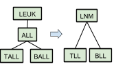
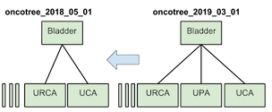
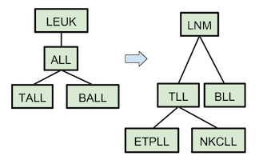
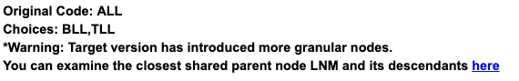
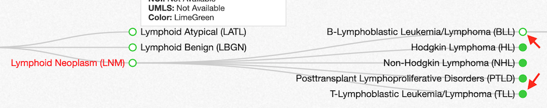

# Contents
* [OncoTree to OncoTree Mapping Tool](#oncotree-to-oncotree-mapping-tool)
* [Ontology to Ontology Mapping tool](#ontology-to-ontology-mapping-tool)

# OncoTree to OncoTree Mapping Tool

The OncoTree Mapping tool was developed to facilitate the mapping of OncoTree codes between different OncoTree release versions. Below you can find basic instructions in the "Running the tool" section, and a detailed walkthrough in the "Tutorial" section.

## Setting up and downloading the tool

Click here to download the script: <span class="text-primary" style="font-size:1.5em; font-weight:bold;">[oncotree_to_oncotree.py <span class="text-primary oi oi-data-transfer-download"></span>](http://oncotree.mskcc.org/downloads/oncotree_to_oncotree.py)</span>

## Running the tool

The OncoTree Mapping tool can be run with the following command:


```
python <path/to/scripts/oncotree_to_oncotree.py> --source-file <path/to/source/file> --target-file <path/to/target/file> --source-version <source_oncotree_version> --target-version <target_oncotree_version>
```

**Options**
- `-i | --source-file`: This is the source clinical file path. It must contain `ONCOTREE_CODE` in the file header and it must contain OncoTree codes corresponding to the `<source_oncotree_version>`. Read more about the cBioPortal clinical file format [here](https://docs.cbioportal.org/5.1-data-loading/data-loading/file-formats#clinical-data).
- `-o | --target-file`: This is the path to the target clinical file that will be generated. It will contain mapped OncoTree codes from `<source_oncotree_version>`-to-`<target_oncotree_version>`.
- `-s | --source-version`: This is the source OncoTree version. The OncoTree codes in the source file must correspond to this version.
- `-t | --target-version`: This is the target OncoTree version that the script will attempt to map the source file OncoTree codes to.

The list of OncoTree versions available are viewable [here](http://oncotree.mskcc.org/api/versions) or on the dropdown menu of the [OncoTree home page](http://oncotree.mskcc.org/#/home).

Note: <span class="oi oi-warning text-danger" aria-hidden="true"></span> the source file should not contain embedded line breaks within any single cell in the table, such as those created by using the keyboard combinations Alt-Enter or Command-Option-Enter while editing a cell in Microsoft Excel.

For a detailed walkthrough of running the tool, see the "Tutorial" section below.

## Output

 The OncoTree Mapper Tool will automatically replace the value in the `ONCOTREE_CODE` column with the mapped code if available. The tool will also add a new column called `ONCOTREE_CODE_OPTIONS` containing suggestions for OncoTree codes if one or more nodes could not be directly mapped. The `ONCOTREE_CODE_OPTIONS` column formats its suggestions differently depending on the mapping results. Possible suggestion formats and corresponding examples are shown below.

### 1. Unambiguous Direct Mappings
 Unambiguous direct mappings occur when an OncoTree code maps directly to a single code in the target version. In this case, the `ONCOTREE_CODE_OPTIONS` column will be left blank, and the mapped code will be automatically placed in the `ONCOTREE_CODE` column. Unambiguous direct mappings are checked for addition of more granular nodes; to see how this may affect the `ONCOTREE_CODE_OPTIONS` column formatting, please refer to the subsection below "4. More Granular Nodes Introduced".

### 2. Ambiguous Direct Mappings
 Ambiguous direct mappings occur when an OncoTree code maps to multiple codes in the target version. The `ONCOTREE_CODE_OPTIONS` column formats the output as follows:

 > 'Source Code' -> {'Code 1', 'Code 2', 'Code 3', <span class="oi oi-ellipses"></span>} &emsp; e.g. _ALL -> {TLL, BLL}_

 **Example: Schema describing the revocation of OncoTree node ALL is mapped to multiple nodes.**



> In `oncotree_2018_05_01`, `ALL` had two children: `TALL` and `BALL`. On release `oncotree_2018_06_01`, the ALL node was discontinued and the `TALL` node was renamed `TLL` and the `BALL` node was renamed `BLL`.

**The `ONCOTREE_CODE_OPTIONS` column would be shown as follows:**
> _ALL -> {TLL, BLL}_

Ambiguous direct mappings are also checked for addition of more granular nodes; to see how this may affect the `ONCOTREE_CODE_OPTIONS` column formatting, please refer to the subsection below "4. More Granular Nodes Introduced".

### 3. No Direct Mappings
 No direct mappings occur when the source OncoTree code is unrelated to any OncoTree code in  the target version. One such possibility is mapping a newly introduced OncoTree code backwards in time. In this case, the tool finds the closest set of **neighbors** (e.g parents and children) which are mappable in the target version. The `ONCOTREE_CODE_OPTIONS` column returns the set with the keyword **Neighbors** as follows:

 > 'Source Code' -> **Neighbors** {'Code 1', 'Code 2', 'Code 3', <span class="oi oi-ellipses"></span>} &emsp; e.g. _UPA -> Neighbors {BLADDER}_

 **Example: Schema describing a case where new OncoTree node UPA cannot be directly mapped backwards to a node.**



> In `oncotree_2019_03_01`, `UPA` was added to the OncoTree as a child node of `BLADDER`. Because `UPA` did not exist in previous version `oncotree_2018_05_01` and did not replace any existing node, the tool uses the surrounding nodes when mapping backwards. In this case, the parent node `BLADDER` is returned as the closest match.

**The `ONCOTREE_CODE_OPTIONS` column would be shown as follows:**
> _UPA -> Neighbors {BLADDER}_

### 4. More Granular Nodes Introduced
In certain cases, the target version can also introduce nodes with more specific descriptions. When this occurs, the tool will add the string `more granular choices introduced` to the existing text in the `ONCOTREE_CODE_OPTIONS` column as follows:

> _'Source Code' -> {'Code 1', <span class="oi oi-ellipses"></span>}, **more granular choices introduced**_
> e.g. _TALL -> {TLL}, more granular choices introduced_

 **Example: Schema describing a case where OncoTree node TALL is mapped to a node with more granular children**



> In `oncotree_2019_03_01`, `TALL` was a leaf node with no children. In release `oncotree_2019_06_01`, `TLL` was introduced as a replacement for `TALL` with additional children `ETPLL` and `NKCLL`.

**The `ONCOTREE_CODE_OPTIONS` column would be shown as follows:**
> _TALL -> {TLL}, more granular choices introduced_

### 5. Invalid Source OncoTree Code
 An invalid source OncoTree Code means the provided code cannot be found in the source version. In such a case, mapping cannot be attempted and the `ONCOTREE_CODE_OPTIONS` column displays the following:

 > _'Source Code' -> ???, OncoTree code not in source OncoTree version_

## Tutorial
The following tutorial will guide the user through using the **oncotree_to_oncotree.py** tool. The tutorial will go through the expected output to highlight specific mapping cases. Additionally, the tutorial will cross-reference the output with the generated mapping summary to demonstrate how it can be used to aid in manual selection of unresolved nodes.

#### Step 1
Download the sample input file (data_clinical_sample.txt) from [here <span class="text-primary oi oi-external-link"></span>](https://raw.githubusercontent.com/cBioPortal/oncotree/master/docs/resources/data_clinical_sample.txt).
#### Step 2
Download oncotree_to_oncotree.py from [here <span class="text-primary oi oi-data-transfer-download"></span>](http://oncotree.mskcc.org/downloads/oncotree_to_oncotree.py).
#### Step 3
Run the following command from the command line:

`python oncotree_to_oncotree.py -i data_clinical_sample.txt -o data_clinical_sample_remapped.txt -s oncotree_2018_03_01 -t oncotree_2019_03_01`

The tool will output two files: `data_clinical_sample_remapped.txt` and `data_clinical_sample_remapped_summary.html`.
For your reference, you can see the expected output files - [here <span class="text-primary oi oi-external-link"></span>](https://raw.githubusercontent.com/cBioPortal/oncotree/master/docs/resources/data_clinical_sample_remapped.txt) and [here <span class="text-primary oi oi-external-link"></span>](https://raw.githubusercontent.com/cBioPortal/oncotree/master/docs/resources/data_clinical_sample_remapped_summary.html)
#### Step 4
Examine `data_clinical_sample_remapped.txt`; the first five columns of the file should look as follows:

|PATIENT_ID|SAMPLE_ID|AGE_AT_SEQ_REPORT|ONCOTREE_CODE|ONCOTREE_CODE_OPTIONS|
|-------|-------|-------|-------|-------|
|P1|S1|41||ALL -> {BLL,TLL}, more granular choices introduced|
|P2|S2|60||BALL -> {BLL}, more granular choices introduced|
|P3|S3|<18||TALL -> {TLL}, more granular choices introduced|
|P4|S4|71|PTCL||
|P5|S5|64|PTCL||
|P6|S6|36||CHL -> {CHL}, more granular choices introduced|
|P7|S7|63||SpCC -> ???, OncoTree code not in source OncoTree version|
|P8|S8|63||MCL -> {MCL}, more granular choices introduced|
|P9|S9|73||HGNEE -> ???, OncoTree code not in source OncoTree version|
|P10|S10|52||ONCOTREE_CODE column blank : use a valid OncoTree code or "NA"|
|P11|S11|77|NA||
|P12|S12|87||TNKL -> {MTNN}, more granular choices introduced|
|P13|S13|79||HIST -> {HDCN}, more granular choices introduced|
|P14|S14|53|CLLSLL||
|P15|S15|69|CLLSLL||
|P16|S16|65||LEUK -> {MNM}, more granular choices introduced|
|P17|S17|66|MYCF||
|P18|S18|66|RBL||

#### Step 5
Using values in the `ONCOTREE_CODE_OPTIONS` as a guide, manually select and place an OncoTree Code in the `ONCOTREE_CODE` column. For additional information, refer to the summary file `data_clinical_sample_remapped_summary.html`. Repeat for all rows in the output file. Several examples are shown below.

###### Sample 1

|SAMPLE_ID|ONCOTREE_CODE  |ONCOTREE_CODE_OPTIONS|
|:--------|:-------------:|:----------------------:|
|S1       |	              |ALL -> {BLL,TLL}, more granular choices introduced|

Source OncoTree code `ALL` maps directly to codes `BLL` and `TLL`. Users should place either `BLL` or `TLL` in the `ONCOTREE_CODE` column. The `ONCOTREE_CODE_OPTIONS` column also notes that more granular choices were introduced; as such, users can use the summary file for additional guidance.

Searching by source code, the following information can be found in the summary file:

The summary file provides a link to the closest shared parent node `LNM`; users can choose more granular nodes by referencing the provided tree:


###### Sample 2

|SAMPLE_ID|ONCOTREE_CODE  |ONCOTREE_CODE_OPTIONS|
|:--------|:-------------:|:----------------------:|
|S2       |	              |BALL -> {BLL}, more granular choices introduced|

Source OncoTree code `BALL` maps directly to `BLL`. Users should place `BLL` in the `ONCOTREE_CODE` column. However, similar to sample 1, the `ONCOTREE_CODE_OPTIONS` indicates there are more granular choices available. Users can follow the same steps as above and use the summary file to select a more granular node.

###### Sample 4

|SAMPLE_ID|ONCOTREE_CODE  |ONCOTREE_CODE_OPTIONS|
|:--------|:-------------:|:----------------------:|
|S4       |	PTCL          |                        |

No additional resolution is needed; the previous OncoTree code was already automatically mapped to PTCL and placed in the `ONCOTREE_CODE` column. `ONCOTREE_CODE_OPTIONS` is empty because no manual selections were necessary.

###### Sample 9

|SAMPLE_ID|ONCOTREE_CODE  |ONCOTREE_CODE_OPTIONS|
|:--------|:-------------:|:----------------------:|
|S4       |	              |HGNEE -> ???, OncoTree code not in source OncoTree version|

Source OncoTree code `HGNEE` was not found in the source OncoTree version and therefore could not be mapped. Users can either reassign a new source OncoTree code (and rerun the script) or remove the sample.

#### Step 6
After filling in the `ONCOTREE_CODE` column with an OncoTree code for each sample, use an editor (e.g. Microsoft Excel, vim, etc.) to trim off the `ONCOTREE_CODE_OPTIONS` column. The resulting file will be a new `data_clinical_sample.txt` file with all codes mapped to the target version. The first four columns of the final result is shown below:

|PATIENT_ID|SAMPLE_ID|AGE_AT_SEQ_REPORT|ONCOTREE_CODE|
|-------|-------|-------|-------|
|P1|S1|41|BLL|
|P2|S2|60|BLL|
|P3|S3|<18|TLL|
|P4|S4|71|PTCL|
|P5|S5|64|PTCL|
|P6|S6|36|CHL|
|P7|S7|63|SPCC|
|P8|S8|63|MCL|
|P10|S10|52|NA|
|P11|S11|77|NA|
|P12|S12|87|MTNN|
|P13|S13|79|HDCN|
|P14|S14|53|CLLSLL|
|P15|S15|69|CLLSLL|
|P16|S16|65|MNM|
|P17|S17|66|MYCF|
|P18|S18|66|RBL|

# Ontology to Ontology Mapping Tool

The Ontology Mapping tool was developed to facilitate the mapping between different cancer classification systems. We currently allow the mappings between OncoTree, ICD-O, NCIt, UMLS and HemeOnc systems. The tool and the mapping file (the mapping file does not need to be downloaded to run the tool) can be found [here](https://github.com/cBioPortal/oncotree/tree/master/scripts/ontology_to_ontology_mapping_tool)

## Prerequisites

The Ontology Mapping tool runs on python 3 and requires `pandas` and `requests` libraries. These libraries can be installed using


```
pip3 install pandas
pip3 install requests
```

## Running the tool

The Ontology Mapping tool can be run with the following command:


```
python <path/to/scripts/ontology_to_ontology_mapping_tool.py> --source-file <path/to/source/file> --target-file <path/to/target/file> --target-code <target_ontology_code>
```

**Options**
 - `i | --source-file`: This is the source file path. The source file must contain one of the `ONCOTREE_CODE`, `NCIT_CODE`, `UMLS_CODE`, `ICDO_TOPOGRAPHY_CODE`, `ICDO_MORPHOLOGY_CODE` or `HEMEONC_CODE` in the file header and it must contain codes corresponding to the Ontology System.
 - `o | --target-file`: This is the path to the target file that will be generated. It will contain ontologies mapped from source code in `<source-file>` to `<target-code>`.
 - `s | --source-code`: This is the source ontology code in `<source-file>`. It must be one of the `ONCOTREE_CODE`, `NCIT_CODE`, `UMLS_CODE`, `ICDO_TOPOGRAPHY_CODE`, `ICDO_MORPHOLOGY_CODE` or `HEMEONC_CODE`.
 - `t | --target-code`: This is the target ontology code that the script will attempt to map the source file ontology code to. It must be one of the `ONCOTREE_CODE`, `NCIT_CODE`, `UMLS_CODE`, `ICDO_TOPOGRAPHY_CODE`, `ICDO_MORPHOLOGY_CODE` or `HEMEONC_CODE`.

**Note**
- The source file should be tab delimited and should contain one of the ontology: `ONCOTREE_CODE`, `NCIT_CODE`, `UMLS_CODE`, `ICDO_TOPOGRAPHY_CODE`, `ICDO_MORPHOLOGY_CODE` or `HEMEONC_CODE` in the file header.
- We currently are allowing only one ontology to another ontology mapping. In the future, we plan to extend the tool to support mapping to multiple ontology systems.
